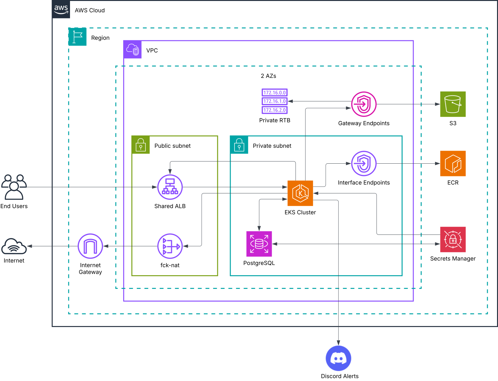

# 📋 DevOps To-Do List — Learning Project

A simple To-Do web application built as a hands-on playground for practising SDLC, cloud, and infrastructure engineering. The app itself (task tracking with authentication) is intentionally minimal — the real work is everything underneath: the pipeline, infrastructure, and deployment architecture.

---

## 🌍 Live Demo: [onlytodo.xyz](http://onlytodo.xyz)

> **⏳ Availability notice:** To conserve AWS credits, the environment runs on a strict schedule. The infrastructure is automatically provisioned each morning and fully destroyed each evening. It is only accessible **weekdays, 09:00–18:00 Bangkok time (UTC+7)**, not accounting for cold-start time and DNS propagation. Outside these hours, the environment does not exist.

---

## ⚠️ Project Status & Important Notes

- **Work in progress.** Expect active refactoring, cleanup, and occasional breakage as the project evolves.
- **Budget-constrained.** This runs on the AWS Free Tier and promotional credits. As a result, certain production best practices — multi-AZ deployments, advanced security layers, comprehensive logging — are intentionally compromised or omitted.
- **Known anti-patterns.** Architectural shortcuts exist for cost reasons. They are acknowledged, not accidental.
- **Evolving stack.** Tools are swapped in and out as the project progresses. The sections below reflect the current state.

---

## 🛠️ Current Tech Stack

### Application
| Layer | Tool |
|---|---|
| Frontend | SvelteKit |
| Backend | Go |

### Data
| Layer | Tool |
|---|---|
| Relational Database | PostgreSQL on Amazon RDS |
| File Storage | Amazon S3 |

### Containerization & Orchestration
| Layer | Tool |
|---|---|
| Containers | Docker |
| Registry | Amazon ECR |
| Orchestration | Kubernetes |
| Package Management | Helm |
| Ingress Controller | AWS Load Balancer Controller |

### Infrastructure
| Layer | Tool |
|---|---|
| Cloud Provider | AWS |
| Infrastructure as Code | Terraform |
| Remote State | S3 + Native Terraform Locking |

### CI/CD & GitOps
| Layer | Tool |
|---|---|
| CI Pipeline | GitHub Actions |
| Cron Scheduler | GitLab CI/CD *(triggers GitHub Actions for daily infra up/down)* |
| GitOps CD | Argo CD |
| Automated Image Updates | Argo CD Image Updater |
| E2E Testing | Playwright |

### Monitoring & Observability
| Layer | Tool |
|---|---|
| Metrics & Alerting | Prometheus + Alertmanager |
| Dashboards | Grafana |
| Alert Delivery | Discord (via webhook) |

---

## 📐 Architecture Overview



Diagram of the *inside* of the EKS cluster is coming soon!

## 🔄 Pipeline Overview

```
Code Push
  └─► GitHub Actions CI
        ├─► Playwright E2E Tests
        └─► Build & Push Docker Images → Amazon ECR
                                              │
                                        Argo CD Image Updater detects new tag
                                              │
                                        Argo CD syncs Helm release → EKS
```

**Infrastructure lifecycle** (weekdays only):
```
GitLab Cron (morning)  →  Triggers GitHub Actions: infra-up
  └─► Terraform Apply (VPC, EKS, RDS, ECR, S3)
  └─► Install AWS LBC, Argo CD, Argo CD Image Updater
  └─► Install kube-prometheus-stack

GitLab Cron (evening)  →  Triggers GitHub Actions: infra-down
  └─► ALB cleanup → Terraform Destroy
  └─► Domain parked via Porkbun API
```

---

## 🗄️ Former Tools

| Tool | Reason Removed |
|---|---|
| Ansible | Replaced by container-based deployments |
| GitLab CI/CD *(as primary pipeline)* | Free-tier compute limits; migrated to GitHub Actions. GitLab remains in use solely as a cron scheduler. |
